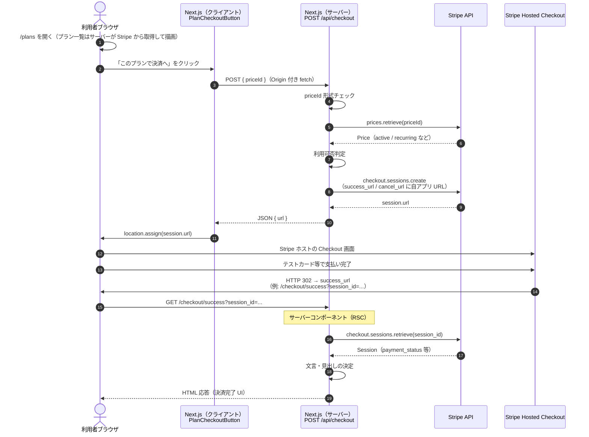
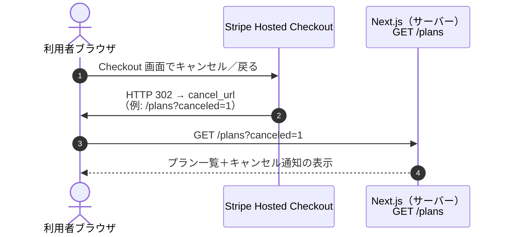

# Stripe 課金フロー（本リポジトリの実装整理）

このドキュメントは、`next-subscription-demo` における **サブスクリプション決済（Hosted Checkout）** の流れを、**ブラウザ・Next.js サーバー・Stripe** の関係で整理したものです。テストモード（`sk_test_` / `pk_test_`）を想定しています。

## 構成要素の役割

| 要素                        | 役割                                                                                                 |
| --------------------------- | ---------------------------------------------------------------------------------------------------- |
| **利用者ブラウザ**          | プラン一覧の表示、決済ボタン、Checkout 画面、完了後の画面表示                                        |
| **Next.js（クライアント）** | `PlanCheckoutButton` が `/api/checkout` を `fetch`、返却された URL へ `location.assign`              |
| **Next.js（サーバー）**     | Route Handler で Checkout Session 作成・価格検証。完了ページ（RSC）で Session の読み取りと HTML 生成 |
| **Stripe API**              | 価格の参照、Checkout Session の作成・取得。サーバーは **シークレットキー** で呼び出す                |
| **Stripe Hosted Checkout**  | カード入力などの決済 UI。Stripe がホストし、完了後に `success_url` / `cancel_url` へリダイレクト     |

**重要:** 現状のコードベースでは **Webhook は未実装** です。サーバー側の「決済成立」の裏付けとしては、次のような層があります。

- **Route Handler（`/api/checkout`）** … 課金に使う `price_...` が Stripe 上で有効な recurring か検証してからセッションを作る
- **完了ページ（`/checkout/success`）** … URL の `session_id` を **サーバーで** Stripe に問い合わせ、`payment_status` などに応じて表示文面を決める（**クライアントが改ざんしやすいクエリだけでは信用しない**）

恒久的な利用権・契約状態を自前 DB に載せる場合は、別途 **Webhook（`stripe listen` など）でイベントを受け取り整合させる** パターンが一般的です（本ドキュメント末尾の「今後の拡張」を参照）。

---

## シーケンス図（Happy path：決済完了まで）

---

## シーケンス図（キャンセル：Checkout で戻る）

---

## 検証が行われるポイント（サーバー）

1. **`POST /api/checkout`**
   - リクエスト JSON の妥当性
   - Stripe 上の Price が **存在・有効・アクティブ・recurring** か
   - `STRIPE_SECRET_KEY` による Stripe 本体への API 呼び出し（改ざんされた `priceId` をそのまま課金に使わせない）

2. **`GET /checkout/success`**（サーバー側レンダリング時）
   - クエリの `session_id` を **秘密キー** で `checkout.sessions.retrieve`
   - `payment_status` / `status` に応じて利用者向けメッセージを出し分け（表示用の最低限の検証）

クライアントには **シークレットキーを渡さない** 前提です。決済の権威ある状態は Stripe 側にあり、アプリは API 経由で読むだけに留めています。

---

## クライアントへの「反映」のされ方

| 段階             | 反映のされ方                                                                                  |
| ---------------- | --------------------------------------------------------------------------------------------- |
| プラン一覧       | サーバーが Stripe から Price 一覧を取得して HTML を生成（`/plans`）                           |
| 決済画面へ遷移   | フルページ遷移（`session.url`）。SDK 埋め込みではなく Hosted Checkout                         |
| 完了・キャンセル | Stripe からの **HTTP リダイレクト** で URL が変わり、**新しいページをサーバーが生成**して返す |

いわゆる「Webhook を受けてクライアントにプッシュする」仕組みは **未実装** です。完了の体験は **リダイレクト先のページの内容** で表現されています。

---

## 環境変数・ URL の扱い（関連）

- **`STRIPE_SECRET_KEY`** … サーバーから Stripe API へ接続（Checkout Session 作成・Session 取得）
- **`success_url` / `cancel_url`** … `getAppBaseUrl(request)` と `NEXT_PUBLIC_APP_URL`（任意）で組み立て。プレビュー環境等では Origin と実 URL がずれるため、`NEXT_PUBLIC_APP_URL` の明示が有効なことがあります。

---

## 今後の拡張（参考）

ドキュメント [`subscription-local-test.md`](./subscription-local-test.md) にあるとおり、**契約状態をアプリの DB にミラーする**場合は次のような流れが追加されます。

- Stripe → **`POST /api/webhooks/stripe`（署名検証・生ボディ）** → DB 更新
- 利用者向け UI は DB または Stripe API の両方と整合を取る設計にする

本ファイルの図は **現状の Checkout 中心実装** に対応しており、Webhook は図に含めていません。
